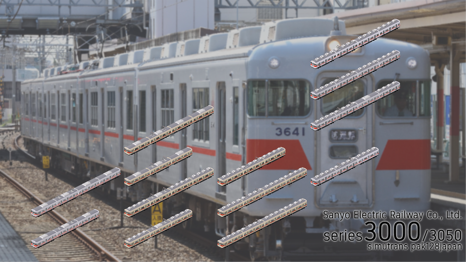

# 山陽電鉄セット
作者 - あるみどり (Twitter:[@G_alumi](https://twitter.com/G_alumi))

ライセンス - [CC BY-NC-SA](https://creativecommons.org/licenses/by-nc-sa/4.0/deed.ja)

サムネ提供 - [@kasiwa1999](https://twitter.com/kasiwa1999) 
## セット内容
- 3000/3050系

そのうち"山陽電鉄セット"と呼べるような内容にします。
## 3000/3050系

主に山陽3000/3050系の冷房改造以降の車です。鋼製リバイバルはめんどくさかったので作っていません。

命名規則は

Gal_sanyo3000_[形式名]\_[車体]\_[塗装]_(\_[クーラー種類])(\_[リニューアル]\(\_[パンタグラフ]))_

のようにしています。

- 形式名
  - 3000系 (Mc3000, M3000, T3500, Tc3600)
  - 3005系 (Mc3050, M3050, T3530, Tc3630)
- 車体
  - 3000系 初期アルミ車 (AL)
    - 塗装
      - 太帯 (normal)
	  - 細帯リバイバル (thin)
	  - 新アルミ車組み込み(T3500のみ) (newColor)
  - 3000系 鋼製車 (steel)
    - クーラー
	  - 分散冷改 (separated)
	  - 集中冷改 (single)
	- リニューアル(リニューアル車にRN記載)
	  - パンタグラフ (下枠交差型にcross記載)
	- 塗装
      - 通常塗装 (normal)
	  - アルミ車塗装(Tc3600のみ)(分散冷改非リニューアルのみ) (ALColor)
  - 3050系 鋼製車 (steel)
	- リニューアル(リニューアル車にRN記載)
	- 塗装
      - 通常塗装 (normal)
  - 3050系 新アルミ車 (newAL)
    - 塗装
	  - 通常塗装 (normal)
	    - リニューアル(リニューアル車にRN記載)
	  - 鋼製車塗装(Mc3050,M3050,T3530のみ) (steelColor)
  - 3050系 新アルミ車6次 (newAL6th)
    - 塗装
	  - 通常塗装 (normal)

基本的には同じ仕様で3または4連が組成できます。
また、同一系統の塗装でMc-M+Mc-M-(T-)TcやMc-M-Tc+Tcのような4連増結計画やTcサハ代用も出来るようにしてあるのでいっぱいふざけてください。

## その他
5000作りたい。